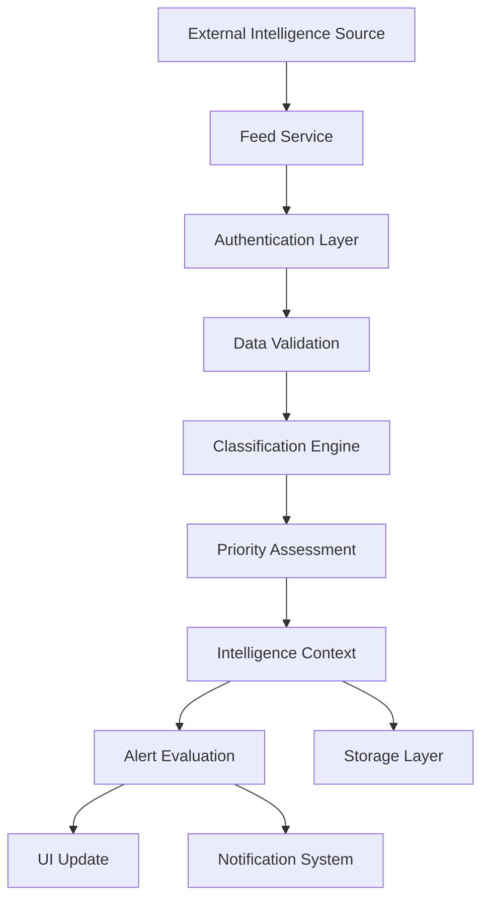

# Data Flow & State Management - Tactical Intelligence Dashboard

## Overview
This guide details the data flow architecture and state management patterns for the tactical intelligence dashboard, ensuring efficient real-time processing while maintaining the existing architectural patterns.

## State Management Architecture

### 1. Context-Based State Management

The dashboard uses React Context for state management, following the existing pattern while extending it for tactical intelligence needs.

```typescript
// State Management Hierarchy
App
├── SettingsProvider (existing - enhanced)
├── ThemeProvider (existing)
├── HealthProvider (existing)
├── IntelligenceProvider (new)
├── AlertProvider (new)
├── SecurityProvider (new)
└── OperationalProvider (new)
```

### 2. Enhanced Settings Context

```typescript
// Enhanced SettingsContext.tsx
export interface TacticalSettingsState {
  // Existing settings
  general: GeneralSettings;
  theme: ThemeSettings;
  export: ExportSettings;
  cors: CorsSettings;
  
  // New tactical settings
  intelligence: IntelligenceSettings;
  security: SecuritySettings;
  operational: OperationalSettings;
  alerts: AlertSettings;
}

export interface IntelligenceSettings {
  classification: {
    defaultLevel: ClassificationLevel;
    autoClassify: boolean;
    displayWarnings: boolean;
    restrictedAccess: boolean;
  };
  sources: {
    enabledCategories: IntelligenceCategory[];
    minimumReliability: number;
    autoRefreshInterval: number;
    maxSourcesPerCategory: number;
  };
  processing: {
    realTimeEnabled: boolean;
    batchSize: number;
    processingDelay: number;
    retryAttempts: number;
  };
  storage: {
    retentionPeriod: number; // days
    compressionEnabled: boolean;
    encryptionLevel: 'basic' | 'enhanced' | 'maximum';
  };
}

export const useEnhancedSettings = () => {
  const context = useContext(SettingsContext);
  if (!context) {
    throw new Error('useEnhancedSettings must be used within SettingsProvider');
  }
  
  const updateIntelligenceSettings = useCallback((updates: Partial<IntelligenceSettings>) => {
    context.updateSettings({
      intelligence: { ...context.settings.intelligence, ...updates }
    });
  }, [context]);
  
  return {
    ...context,
    updateIntelligenceSettings,
    intelligenceSettings: context.settings.intelligence
  };
};
```

### 3. Intelligence Data Context

```typescript
// New IntelligenceContext.tsx
export interface IntelligenceState {
  items: IntelligenceItem[];
  sources: TacticalIntelSource[];
  processingQueue: ProcessingQueueItem[];
  statistics: IntelligenceStatistics;
  lastUpdate: Date;
  isProcessing: boolean;
  errors: IntelligenceError[];
}

export interface IntelligenceActions {
  addIntelligence: (item: IntelligenceItem) => Promise<void>;
  updateIntelligence: (id: string, updates: Partial<IntelligenceItem>) => Promise<void>;
  removeIntelligence: (id: string) => Promise<void>;
  addSource: (source: TacticalIntelSource) => Promise<void>;
  updateSource: (id: string, updates: Partial<TacticalIntelSource>) => Promise<void>;
  removeSource: (id: string) => Promise<void>;
  processQueue: () => Promise<void>;
  clearErrors: () => void;
  refreshSources: (sourceIds?: string[]) => Promise<void>;
}

export const IntelligenceProvider: React.FC<{ children: React.ReactNode }> = ({ children }) => {
  const [state, setState] = useState<IntelligenceState>(() => ({
    items: [],
    sources: [],
    processingQueue: [],
    statistics: {
      totalItems: 0,
      byCategory: {},
      byClassification: {},
      byPriority: {},
      processingRate: 0,
      errorRate: 0
    },
    lastUpdate: new Date(),
    isProcessing: false,
    errors: []
  }));
  
  // Real-time processing
  const processIncomingIntelligence = useCallback(async (rawData: RawIntelligenceData) => {
    setState(prev => ({ ...prev, isProcessing: true }));
    
    try {
      // 1. Validate incoming data
      const validatedData = await validateIntelligenceData(rawData);
      
      // 2. Apply classification
      const classifiedItem = await classifyIntelligence(validatedData);
      
      // 3. Calculate reliability and priority
      const processedItem = await processIntelligenceItem(classifiedItem);
      
      // 4. Update state
      setState(prev => ({
        ...prev,
        items: [processedItem, ...prev.items],
        statistics: updateStatistics(prev.statistics, processedItem),
        lastUpdate: new Date(),
        isProcessing: false
      }));
      
      // 5. Trigger alerts if necessary
      if (processedItem.priority === 'CRITICAL') {
        await triggerAlert(processedItem);
      }
      
    } catch (error) {
      setState(prev => ({
        ...prev,
        errors: [createIntelligenceError(error), ...prev.errors],
        isProcessing: false
      }));
    }
  }, []);
  
  const actions: IntelligenceActions = {
    addIntelligence: processIncomingIntelligence,
    updateIntelligence: async (id, updates) => {
      setState(prev => ({
        ...prev,
        items: prev.items.map(item => 
          item.id === id ? { ...item, ...updates } : item
        )
      }));
    },
    // ... other actions
  };
  
  return (
    <IntelligenceContext.Provider value={{ state, actions }}>
      {children}
    </IntelligenceContext.Provider>
  );
};
```

### 4. Alert Management Context

```typescript
// New AlertContext.tsx
export interface AlertState {
  active: IntelligenceAlert[];
  acknowledged: IntelligenceAlert[];
  dismissed: IntelligenceAlert[];
  config: AlertConfiguration;
  statistics: AlertStatistics;
}

export const AlertProvider: React.FC<{ children: React.ReactNode }> = ({ children }) => {
  const [state, setState] = useState<AlertState>(() => ({
    active: [],
    acknowledged: [],
    dismissed: [],
    config: getDefaultAlertConfiguration(),
    statistics: {
      totalAlerts: 0,
      criticalAlerts: 0,
      averageResponseTime: 0,
      acknowledgedRate: 0
    }
  }));
  
  const createAlert = useCallback(async (item: IntelligenceItem): Promise<IntelligenceAlert> => {
    const alert: IntelligenceAlert = {
      id: generateAlertId(),
      intelligenceId: item.id,
      type: determineAlertType(item),
      priority: item.priority,
      title: generateAlertTitle(item),
      message: generateAlertMessage(item),
      timestamp: new Date(),
      status: 'active',
      assignedTo: await determineAssignee(item),
      escalationLevel: 0,
      metadata: {
        sourceId: item.sourceId,
        classification: item.classification,
        location: item.location
      }
    };
    
    setState(prev => ({
      ...prev,
      active: [alert, ...prev.active],
      statistics: updateAlertStatistics(prev.statistics, alert)
    }));
    
    // Trigger notification systems
    await triggerNotifications(alert);
    
    return alert;
  }, []);
  
  const acknowledgeAlert = useCallback(async (alertId: string, userId: string) => {
    setState(prev => {
      const alert = prev.active.find(a => a.id === alertId);
      if (!alert) return prev;
      
      const acknowledgedAlert = {
        ...alert,
        status: 'acknowledged' as const,
        acknowledgedBy: userId,
        acknowledgedAt: new Date()
      };
      
      return {
        ...prev,
        active: prev.active.filter(a => a.id !== alertId),
        acknowledged: [acknowledgedAlert, ...prev.acknowledged]
      };
    });
  }, []);
  
  return (
    <AlertContext.Provider value={{ state, createAlert, acknowledgeAlert }}>
      {children}
    </AlertContext.Provider>
  );
};
```

## Data Flow Patterns

### 1. Real-time Intelligence Processing Flow



### 2. User Action Flow

```typescript
// Example: Adding a new intelligence source
const addSourceFlow = async (sourceData: NewSourceData) => {
  // 1. User initiates action
  const userAction = { type: 'ADD_SOURCE', payload: sourceData };
  
  // 2. Validate user permissions
  const hasPermission = await validateUserPermission(user, 'ADD_SOURCE');
  if (!hasPermission) throw new Error('Insufficient permissions');
  
  // 3. Validate source data
  const validatedSource = await validateSourceData(sourceData);
  
  // 4. Test source connectivity
  const connectionTest = await testSourceConnection(validatedSource);
  if (!connectionTest.success) throw new Error('Source connection failed');
  
  // 5. Update state
  const source: TacticalIntelSource = {
    ...validatedSource,
    id: generateSourceId(),
    healthStatus: 'operational',
    lastUpdated: new Date(),
    addedBy: user.id
  };
  
  // 6. Add to context
  await intelligenceActions.addSource(source);
  
  // 7. Start monitoring
  await startSourceMonitoring(source.id);
  
  // 8. Log action
  await logUserAction(userAction, user.id);
};
```

### 3. Data Synchronization Patterns

```typescript
// Real-time synchronization service
export class RealTimeSyncService {
  private websocketManager: WebSocketManager;
  private updateQueue: UpdateQueue;
  private conflictResolver: ConflictResolver;
  
  async initializeSync(): Promise<void> {
    // Initialize WebSocket connections for real-time updates
    this.websocketManager = new WebSocketManager({
      onMessage: this.handleIncomingUpdate.bind(this),
      onError: this.handleSyncError.bind(this),
      onReconnect: this.handleReconnection.bind(this)
    });
    
    // Start processing update queue
    this.updateQueue.start();
  }
  
  private async handleIncomingUpdate(update: IntelligenceUpdate): Promise<void> {
    // 1. Validate update
    const validUpdate = await this.validateUpdate(update);
    
    // 2. Check for conflicts
    const hasConflict = await this.detectConflict(validUpdate);
    
    if (hasConflict) {
      // 3. Resolve conflicts
      const resolvedUpdate = await this.conflictResolver.resolve(validUpdate);
      await this.applyUpdate(resolvedUpdate);
    } else {
      // 4. Apply update directly
      await this.applyUpdate(validUpdate);
    }
    
    // 5. Notify UI components
    this.notifySubscribers(validUpdate);
  }
  
  private async applyUpdate(update: IntelligenceUpdate): Promise<void> {
    switch (update.type) {
      case 'INTELLIGENCE_ADDED':
        await intelligenceActions.addIntelligence(update.payload);
        break;
      case 'INTELLIGENCE_UPDATED':
        await intelligenceActions.updateIntelligence(update.id, update.payload);
        break;
      case 'SOURCE_STATUS_CHANGED':
        await intelligenceActions.updateSource(update.sourceId, { healthStatus: update.status });
        break;
      case 'ALERT_CREATED':
        await alertActions.createAlert(update.payload);
        break;
    }
  }
}
```

## Performance Optimization Strategies

### 1. Data Virtualization

```typescript
// Virtual scrolling for large intelligence lists
export const VirtualizedIntelligenceList: React.FC<{
  items: IntelligenceItem[];
  onItemClick: (item: IntelligenceItem) => void;
}> = ({ items, onItemClick }) => {
  const [visibleRange, setVisibleRange] = useState({ start: 0, end: 20 });
  const containerRef = useRef<HTMLDivElement>(null);
  
  const handleScroll = useCallback(
    throttle((event: React.UIEvent<HTMLDivElement>) => {
      const { scrollTop, clientHeight } = event.currentTarget;
      const itemHeight = 120; // Approximate item height
      const start = Math.floor(scrollTop / itemHeight);
      const end = Math.min(start + Math.ceil(clientHeight / itemHeight) + 5, items.length);
      
      setVisibleRange({ start, end });
    }, 100),
    [items.length]
  );
  
  const visibleItems = items.slice(visibleRange.start, visibleRange.end);
  const totalHeight = items.length * 120;
  const offsetY = visibleRange.start * 120;
  
  return (
    <div
      ref={containerRef}
      className="virtualized-list"
      style={{ height: '600px', overflowY: 'auto' }}
      onScroll={handleScroll}
    >
      <div style={{ height: totalHeight, position: 'relative' }}>
        <div style={{ transform: `translateY(${offsetY}px)` }}>
          {visibleItems.map((item, index) => (
            <TacticalIntelCard
              key={item.id}
              item={item}
              onClick={() => onItemClick(item)}
            />
          ))}
        </div>
      </div>
    </div>
  );
};
```

### 2. Intelligent Caching

```typescript
// Intelligence data caching service
export class IntelligenceCacheService {
  private cache: Map<string, CachedIntelligence>;
  private expirationTimes: Map<string, number>;
  
  async getIntelligence(id: string): Promise<IntelligenceItem | null> {
    // Check cache first
    const cached = this.cache.get(id);
    if (cached && !this.isExpired(id)) {
      return cached.data;
    }
    
    // Fetch from source
    const intelligence = await this.fetchFromSource(id);
    if (intelligence) {
      this.cacheIntelligence(intelligence);
    }
    
    return intelligence;
  }
  
  private cacheIntelligence(item: IntelligenceItem): void {
    const cacheEntry: CachedIntelligence = {
      data: item,
      timestamp: Date.now(),
      accessCount: 1
    };
    
    this.cache.set(item.id, cacheEntry);
    
    // Set expiration based on classification and priority
    const ttl = this.calculateTTL(item);
    this.expirationTimes.set(item.id, Date.now() + ttl);
    
    // Cleanup old entries
    this.cleanupExpiredEntries();
  }
  
  private calculateTTL(item: IntelligenceItem): number {
    // Higher classification and priority = shorter TTL
    const baseTTL = 30 * 60 * 1000; // 30 minutes
    
    let multiplier = 1;
    if (item.classification === 'TOP_SECRET') multiplier *= 0.5;
    if (item.priority === 'CRITICAL') multiplier *= 0.3;
    
    return baseTTL * multiplier;
  }
}
```

### 3. Batch Processing

```typescript
// Batch processing for incoming intelligence
export class BatchProcessor {
  private batchQueue: IntelligenceItem[] = [];
  private batchSize: number = 50;
  private processingInterval: number = 5000; // 5 seconds
  
  constructor() {
    setInterval(() => this.processBatch(), this.processingInterval);
  }
  
  addToBatch(item: IntelligenceItem): void {
    this.batchQueue.push(item);
    
    // Process immediately if batch is full or item is critical
    if (this.batchQueue.length >= this.batchSize || item.priority === 'CRITICAL') {
      this.processBatch();
    }
  }
  
  private async processBatch(): Promise<void> {
    if (this.batchQueue.length === 0) return;
    
    const batch = this.batchQueue.splice(0, this.batchSize);
    
    try {
      // Process all items in parallel
      const processedItems = await Promise.all(
        batch.map(item => this.processIntelligenceItem(item))
      );
      
      // Update state in batch
      intelligenceActions.addIntelligenceBatch(processedItems);
      
      // Generate alerts for critical items
      const criticalItems = processedItems.filter(item => item.priority === 'CRITICAL');
      if (criticalItems.length > 0) {
        await this.generateBatchAlerts(criticalItems);
      }
      
    } catch (error) {
      console.error('Batch processing failed:', error);
      // Re-queue failed items
      this.batchQueue.unshift(...batch);
    }
  }
}
```

## Error Handling & Recovery

### 1. Graceful Degradation

```typescript
// Error boundary for intelligence components
export class IntelligenceErrorBoundary extends React.Component<
  { children: React.ReactNode },
  { hasError: boolean; error?: Error }
> {
  constructor(props: { children: React.ReactNode }) {
    super(props);
    this.state = { hasError: false };
  }
  
  static getDerivedStateFromError(error: Error) {
    return { hasError: true, error };
  }
  
  componentDidCatch(error: Error, errorInfo: React.ErrorInfo) {
    // Log error for analysis
    logIntelligenceError(error, errorInfo);
    
    // Attempt recovery
    this.attemptRecovery();
  }
  
  private attemptRecovery = async () => {
    try {
      // Try to restore from cache
      await restoreFromCache();
      this.setState({ hasError: false, error: undefined });
    } catch (recoveryError) {
      // Recovery failed, show degraded UI
      console.error('Recovery failed:', recoveryError);
    }
  };
  
  render() {
    if (this.state.hasError) {
      return (
        <div className="intelligence-error-fallback">
          <h3>Intelligence System Temporarily Unavailable</h3>
          <p>Operating in degraded mode. Some features may be limited.</p>
          <button onClick={this.attemptRecovery}>
            Retry Connection
          </button>
        </div>
      );
    }
    
    return this.props.children;
  }
}
```

### 2. Connection Recovery

```typescript
// Automatic reconnection service
export class ConnectionRecoveryService {
  private reconnectAttempts: number = 0;
  private maxReconnectAttempts: number = 10;
  private backoffMultiplier: number = 1.5;
  
  async handleConnectionLoss(): Promise<void> {
    console.warn('Intelligence feed connection lost, attempting recovery...');
    
    while (this.reconnectAttempts < this.maxReconnectAttempts) {
      try {
        await this.attemptReconnection();
        console.info('Intelligence feed connection restored');
        this.reconnectAttempts = 0;
        return;
      } catch (error) {
        this.reconnectAttempts++;
        const delay = Math.pow(this.backoffMultiplier, this.reconnectAttempts) * 1000;
        
        console.warn(`Reconnection attempt ${this.reconnectAttempts} failed, retrying in ${delay}ms`);
        await new Promise(resolve => setTimeout(resolve, delay));
      }
    }
    
    // All reconnection attempts failed
    this.handlePermanentConnectionLoss();
  }
  
  private async attemptReconnection(): Promise<void> {
    // Test basic connectivity
    await this.testConnectivity();
    
    // Reconnect to intelligence sources
    await this.reconnectSources();
    
    // Verify data flow
    await this.verifyDataFlow();
  }
  
  private handlePermanentConnectionLoss(): void {
    // Switch to offline mode
    intelligenceActions.setOfflineMode(true);
    
    // Notify users
    alertActions.createSystemAlert({
      type: 'CONNECTION_LOST',
      message: 'Intelligence feeds unavailable. Operating in offline mode.',
      priority: 'HIGH'
    });
  }
}
```

This data flow and state management architecture ensures efficient, reliable operation of the tactical intelligence dashboard while maintaining the existing architectural patterns and providing robust error handling and recovery mechanisms.
